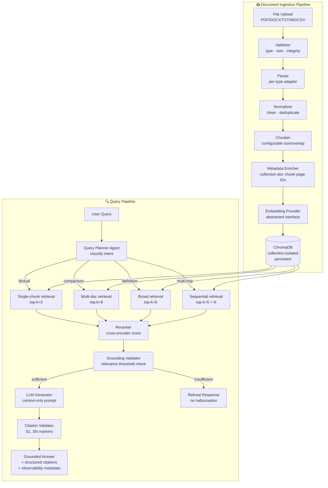

# RAG Generator — Assessment Analysis & Complete Architecture

> **Status**: Phase 1 — Analysis & Architecture  
> **Target**: Submission-ready repository for agentic coding assessment

---

## PHASE 1 — ASSESSMENT INTERPRETATION

### What the Evaluator is Testing

| Dimension | What They're Really Checking |
|---|---|
| **RAG fundamentals** | Can you explain chunking, embedding, retrieval, grounding — not just copy a tutorial? |
| **Runtime generality** | Is the system genuinely document-agnostic, or is it secretly hard-coded? |
| **Agentic reasoning** | Do you understand what an agent *actually* does vs. calling a pipeline "agentic"? |
| **Grounding discipline** | Do you conflate LLM generation with factual grounding, or keep them distinct? |
| **Engineering hygiene** | Structure, tests, error handling, config, documentation — are they real? |
| **Interview defensibility** | Can you justify every decision without hand-waving? |

### What "Runtime Documents" Means

The system must accept documents via API/UI at runtime — not pre-loaded at startup. A completely fresh deployment with zero documents must still function. Any PDF/DOCX/TXT/MD/CSV dropped in at any time must be immediately ingested without code changes.

### What "Different Document Sets Without Code Changes" Means

- Collection A = medical research papers → questions answered only from A
- Collection B = legal contracts → questions answered only from B  
- No domain-specific prompt engineering, no domain-specific parsing logic
- The same binary, same config, same code handles both

### What "Grounded Answers" Means Technically

1. Retrieved chunks are the **only** permitted information source for the LLM
2. If retrieved chunks are insufficient (low relevance scores), the system **refuses** to answer rather than hallucinating
3. Every claim in the answer is traceable to a specific source chunk
4. Citations are structured metadata, not just footnotes

### Where an Agentic Component Genuinely Adds Value

A blind top-k vector search is not always optimal:
- A **factual lookup** ("What is the CEO's name?") → single-chunk retrieval
- A **comparison** ("Compare A and B") → multi-chunk, possibly multi-document
- A **definition** ("Explain concept X") → broader retrieval, synthesis
- A **multi-hop** ("What did they decide after the 2023 review?") → sequential retrieval

The agent adds value by **classifying the query intent** and **selecting the retrieval strategy** — making retrieval decisions explicit, debuggable, and testable rather than always running the same pipeline.

---

## PHASE 2 — ARCHITECTURE

### Technology Decisions

| Component | Choice | Rationale | Alternative Considered |
|---|---|---|---|
| **API framework** | FastAPI | Async, type-safe, auto-docs, standard | Flask (less type-safe), Django (heavyweight) |
| **Vector DB** | ChromaDB | Persistent, local, collection-isolated, no infra | Pinecone (paid), Weaviate (complex), FAISS (no metadata) |
| **Embeddings** | `sentence-transformers` (`all-MiniLM-L6-v2`) | Free, local, semantic quality, fast | OpenAI ada-002 (paid, cloud), TF-IDF (not semantic) |
| **LLM** | OpenAI GPT-4o-mini (configurable) | Cost-efficient, instruction-following | Local Ollama (optional fallback) |
| **PDF parsing** | PyMuPDF (`fitz`) | Page-aware, fast, reliable | pypdf (less metadata), pdfminer (slow) |
| **DOCX parsing** | python-docx | Standard, preserves structure | textract (heavyweight) |
| **Reranking** | Cross-encoder `ms-marco-MiniLM-L-6-v2` | Lightweight, local, meaningful re-score | Cohere Rerank (paid), no reranking (worse precision) |
| **Frontend** | Vanilla HTML/JS + CSS | No build step, evaluator-friendly, simple | React (overkill for assessment) |

### System Architecture Diagram



### Collection Isolation Model

```
ChromaDB
├── collection: "medical-research"     ← Collection A
│   ├── doc: paper1.pdf  (chunks 0-47)
│   └── doc: paper2.pdf  (chunks 0-31)
└── collection: "legal-contracts"      ← Collection B
    ├── doc: contract1.docx (chunks 0-12)
    └── doc: nda.pdf        (chunks 0-8)
```

Every query is scoped to `where={"collection_id": collection_id}` — **ChromaDB's native metadata filtering guarantees isolation.**

### Query Planner Agent — Decision Logic

```
classify_intent(query) → IntentType

IntentType = FACTUAL | DEFINITION | COMPARISON | MULTI_HOP | UNKNOWN

Strategy map:
  FACTUAL    → top_k=3,  rerank=True,  require_score > 0.65
  DEFINITION → top_k=6,  rerank=True,  require_score > 0.55
  COMPARISON → top_k=8,  rerank=True,  require_score > 0.55, multi_doc=True
  MULTI_HOP  → top_k=5,  rerank=True,  require_score > 0.60, sequential=True
  UNKNOWN    → top_k=5,  rerank=True,  require_score > 0.60
```

The agent is a **lightweight LLM call** (cheap model, 1-shot) that returns a structured JSON intent. It is not a loop — it is one deterministic decision gate.

---

## PHASE 3 — REPOSITORY STRUCTURE

```
rag-generator/
│
├── app/
│   ├── __init__.py
│   ├── main.py                    ← FastAPI app entry point
│   ├── config.py                  ← Pydantic settings from env
│   │
│   ├── api/
│   │   ├── __init__.py
│   │   ├── collections.py         ← Collection CRUD endpoints
│   │   ├── documents.py           ← Upload / list document endpoints
│   │   ├── query.py               ← Query endpoint
│   │   └── health.py              ← Health check
│   │
│   ├── core/
│   │   ├── __init__.py
│   │   ├── models.py              ← Pydantic request/response models
│   │   └── exceptions.py          ← Custom exceptions
│   │
│   ├── ingestion/
│   │   ├── __init__.py
│   │   ├── validator.py           ← File type/size/integrity validation
│   │   ├── parsers/
│   │   │   ├── __init__.py
│   │   │   ├── base.py            ← Abstract parser interface
│   │   │   ├── pdf_parser.py
│   │   │   ├── docx_parser.py
│   │   │   ├── txt_parser.py
│   │   │   ├── markdown_parser.py
│   │   │   └── csv_parser.py
│   │   ├── normalizer.py          ← Text cleaning
│   │   └── chunker.py             ← Configurable chunker + metadata
│   │
│   ├── providers/
│   │   ├── __init__.py
│   │   ├── embedding/
│   │   │   ├── __init__.py
│   │   │   ├── base.py            ← Abstract embedding interface
│   │   │   ├── sentence_transformers.py
│   │   │   └── openai_embeddings.py
│   │   └── llm/
│   │       ├── __init__.py
│   │       ├── base.py            ← Abstract LLM interface
│   │       ├── openai_llm.py
│   │       └── ollama_llm.py      ← Local fallback
│   │
│   ├── retrieval/
│   │   ├── __init__.py
│   │   ├── vector_store.py        ← ChromaDB wrapper
│   │   └── reranker.py            ← Cross-encoder reranker
│   │
│   ├── agents/
│   │   ├── __init__.py
│   │   └── query_planner.py       ← Intent classification + strategy selection
│   │
│   ├── generation/
│   │   ├── __init__.py
│   │   ├── grounding.py           ← Relevance validation + refusal logic
│   │   ├── generator.py           ← Context-only LLM prompt + generation
│   │   └── citations.py           ← Citation extraction + validation
│   │
│   └── services/
│       ├── __init__.py
│       ├── ingestion_service.py   ← Orchestrates ingestion pipeline
│       └── rag_service.py         ← Orchestrates query pipeline
│
├── tests/
│   ├── __init__.py
│   ├── conftest.py
│   ├── test_ingestion.py
│   ├── test_chunking.py
│   ├── test_parsers.py
│   ├── test_vector_store.py
│   ├── test_collection_isolation.py
│   ├── test_grounding.py
│   ├── test_citations.py
│   ├── test_api.py
│   └── test_evaluation.py
│
├── evaluation/
│   ├── golden_questions.json      ← Ground-truth Q&A pairs
│   └── evaluate.py                ← Evaluation runner
│
├── sample_docs/
│   ├── set_a/                     ← Domain A: Climate science articles
│   │   ├── climate_overview.txt
│   │   ├── arctic_ice.md
│   │   └── emissions_report.pdf   ← (generated sample)
│   └── set_b/                     ← Domain B: Software engineering
│       ├── python_basics.txt
│       ├── api_design.md
│       └── testing_guide.docx     ← (generated sample)
│
├── static/
│   ├── index.html                 ← Single-page UI
│   ├── style.css
│   └── app.js
│
├── data/                          ← ChromaDB persistence (gitignored)
├── submission/                    ← Conversation transcript goes here
│
├── .env.example
├── .gitignore
├── requirements.txt
├── Dockerfile
├── docker-compose.yml
├── pytest.ini
└── README.md
```

---

## PHASE 4 — DETAILED COMPONENT SPECIFICATIONS

### 4.1 Chunking Strategy

**Chosen strategy**: Recursive character text splitting with configurable parameters.

**Trade-offs documented:**

| Strategy | Pros | Cons |
|---|---|---|
| Fixed-size character split | Simple, predictable | Breaks sentences mid-thought |
| Sentence-based split | Semantically clean | Variable chunk sizes, hard to tune |
| **Recursive character split** ← chosen | Tries paragraphs → sentences → words in order | Slightly more complex |
| Semantic chunking | Best semantic coherence | Requires embedding pass, slow, expensive |

**Metadata preserved per chunk:**
```json
{
  "collection_id": "medical-research",
  "document_id": "uuid-...",
  "chunk_id": "uuid-...",
  "filename": "paper1.pdf",
  "chunk_index": 12,
  "total_chunks": 47,
  "page_number": 3,
  "char_start": 4200,
  "char_end": 4700,
  "source_type": "pdf"
}
```

### 4.2 Embedding Interface

```python
class BaseEmbeddingProvider(ABC):
    @abstractmethod
    def embed_texts(self, texts: list[str]) -> list[list[float]]: ...
    
    @abstractmethod
    def embed_query(self, query: str) -> list[float]: ...
    
    @property
    @abstractmethod
    def dimension(self) -> int: ...
    
    @property
    @abstractmethod
    def model_name(self) -> str: ...
```

**Why this matters**: If you change from `all-MiniLM-L6-v2` (384-dim) to `text-embedding-3-large` (3072-dim), you must re-embed all existing chunks — the interface makes this explicit and testable.

### 4.3 Grounding Logic

```
grounding_decision(chunks, query):
  1. Score each chunk via reranker
  2. Compute max_score = max(chunk.rerank_score for chunk in chunks)
  3. If max_score < GROUNDING_THRESHOLD:
       return INSUFFICIENT_EVIDENCE
  4. Filter to chunks where score >= GROUNDING_THRESHOLD * 0.8
  5. If filtered_chunks is empty:
       return INSUFFICIENT_EVIDENCE
  6. Return PROCEED with filtered_chunks
```

**What this guarantees**: The LLM is never called when retrieval fails. The refusal is explicit in the response.  
**What this does NOT guarantee**: It does not mathematically prove zero hallucination — the LLM could still confabulate from the provided context. The threshold is a heuristic, not a proof.

### 4.4 Citation Format

**In answer text:**
```
The annual temperature increase has been recorded at 1.2°C since pre-industrial levels [S1]. 
Arctic sea ice has declined by 13% per decade [S2][S3].
```

**Structured citation metadata (API response):**
```json
{
  "citations": [
    {
      "id": "S1",
      "document_id": "uuid-...",
      "filename": "climate_overview.txt",
      "chunk_id": "uuid-...",
      "page_number": null,
      "excerpt": "...temperature increase recorded at 1.2°C above...",
      "rerank_score": 0.87
    }
  ]
}
```

---

## PHASE 5 — API CONTRACT

### Endpoints

```
POST   /api/v1/collections
       → create a named collection

GET    /api/v1/collections
       → list all collections

DELETE /api/v1/collections/{collection_id}
       → delete collection + all documents

POST   /api/v1/collections/{collection_id}/documents
       → upload file, trigger ingestion pipeline
       Content-Type: multipart/form-data

GET    /api/v1/collections/{collection_id}/documents
       → list documents in collection

DELETE /api/v1/collections/{collection_id}/documents/{document_id}
       → delete specific document + its chunks

POST   /api/v1/collections/{collection_id}/query
       Body: { "query": "...", "top_k": 5 }
       → run full RAG pipeline, return grounded answer

GET    /api/v1/health
       → system health + embedding model status
```

### Query Response Schema

```json
{
  "query": "What caused the temperature rise?",
  "answer": "According to the documents, the primary cause... [S1][S2]",
  "grounded": true,
  "citations": [...],
  "observability": {
    "intent": "FACTUAL",
    "retrieval_strategy": "top_k=3,rerank=true",
    "chunks_retrieved": 3,
    "chunks_after_rerank": 3,
    "chunks_after_grounding": 2,
    "max_relevance_score": 0.87,
    "grounding_threshold": 0.60,
    "grounding_decision": "PROCEED",
    "latency_ms": 1240
  }
}
```

---

## PHASE 6 — TESTING PLAN

| Test | Type | What It Validates |
|---|---|---|
| `test_pdf_parser` | Unit | PDF parsed correctly, page numbers extracted |
| `test_docx_parser` | Unit | DOCX text extracted, structure preserved |
| `test_txt_parser` | Unit | Plain text handled |
| `test_empty_document` | Unit | Empty file → graceful error, not crash |
| `test_unsupported_type` | Unit | `.exe` upload → 422 Unsupported |
| `test_chunking_metadata` | Unit | All metadata fields present after chunking |
| `test_chunking_coverage` | Unit | No text lost between chunks |
| `test_collection_isolation` | Integration | Query on A never returns B's chunks |
| `test_reingest_deduplication` | Integration | Same file re-ingested → no duplicates |
| `test_retrieval_returns_results` | Integration | Known-content query returns relevant chunk |
| `test_grounded_answer` | Integration | Answer contains citation markers |
| `test_refusal_off_topic` | Integration | Off-topic query → grounded=false, no answer |
| `test_collection_isolation_api` | API | Full API flow A vs B isolation |
| `test_api_health` | API | /health returns 200 |
| `test_api_upload` | API | File upload returns document_id |
| `test_api_query` | API | Query returns structured response |
| `test_different_document_sets` | E2E | Upload unrelated docs, query each, no cross-contamination |
| `test_golden_questions` | Evaluation | Known Q&A pairs score above threshold |

---

## PHASE 7 — CONFIGURATION (.env.example)

```bash
# LLM Provider
LLM_PROVIDER=openai              # openai | ollama
OPENAI_API_KEY=sk-...
LLM_MODEL=gpt-4o-mini
OLLAMA_BASE_URL=http://localhost:11434
OLLAMA_MODEL=llama3.2

# Embedding Provider
EMBEDDING_PROVIDER=sentence_transformers   # sentence_transformers | openai
EMBEDDING_MODEL=all-MiniLM-L6-v2
# OPENAI_EMBEDDING_MODEL=text-embedding-3-small

# Vector Database
CHROMA_PERSIST_DIR=./data/chroma
CHROMA_HOST=                     # leave empty for local mode

# Chunking
CHUNK_SIZE=512
CHUNK_OVERLAP=64
CHUNK_MIN_SIZE=50

# Retrieval
DEFAULT_TOP_K=5
RERANKING_ENABLED=true
RERANKER_MODEL=cross-encoder/ms-marco-MiniLM-L-6-v2

# Grounding
GROUNDING_THRESHOLD=0.60
MAX_QUERY_LENGTH=1000

# Upload
MAX_UPLOAD_SIZE_MB=50
ALLOWED_EXTENSIONS=pdf,docx,txt,md,csv

# API
API_HOST=0.0.0.0
API_PORT=8000
CORS_ORIGINS=*

# Query Planner
QUERY_PLANNER_MODEL=gpt-4o-mini  # cheap model for intent classification
```

---

## PHASE 8 — GROUNDING APPROACH (Honest Limitations)

### What the system does
1. Embeds the query and retrieves top-k chunks from the correct collection
2. Reranks with a cross-encoder for precision
3. Applies a configurable relevance threshold
4. Refuses to call the LLM if no chunk exceeds the threshold
5. Passes only retrieved chunks as context — no other knowledge source
6. Validates that `[S1]`, `[S2]` markers in the answer correspond to real sources

### What it does NOT guarantee
- The LLM may still produce inaccurate paraphrases of real chunks
- The threshold is a heuristic — a clever adversarial query could still slip through
- Cross-encoder reranking scores are not calibrated probabilities
- Very long documents may not have relevant chunks at the exact chunk boundaries

### Honest production improvements
- Sentence-level attribution (highlight which sentence maps to which source)
- NLI-based factuality scoring (e.g., T5-based entailment checker)
- Human evaluation loop for threshold calibration
- Uncertainty quantification in LLM output

---

## PHASE 9 — AGENTIC COMPONENT DEFENSIBILITY

**Q: Why does the agent exist?**  
A: Different query types have different optimal retrieval strategies. Blind top-k treats "What is X?" the same as "Compare X and Y across all documents" — this is suboptimal and wastes context window.

**Q: What decision does it make?**  
A: It classifies query intent into FACTUAL / DEFINITION / COMPARISON / MULTI_HOP / UNKNOWN and selects top_k, reranking mode, and multi-document retrieval mode accordingly.

**Q: What tools/actions can it use?**  
A: `retrieve_single(query, top_k)`, `retrieve_multi_doc(query, top_k)`, `sequential_retrieve(queries)` — these are the retrieval strategies it dispatches to.

**Q: Why is this better than blind top-k?**  
A: For comparison queries, you want chunks from multiple documents. For factual queries, you want high-precision low-k. For multi-hop, you may need two retrieval rounds. The agent makes this explicit.

**Q: What happens when the agent cannot find sufficient evidence?**  
A: The grounding validator intercepts before LLM call. The response is: `{"grounded": false, "answer": "The uploaded documents do not contain sufficient information to answer this question.", "citations": []}`.

---

## PHASE 10 — PRODUCTION IMPROVEMENTS (not claimed in assessment)

- Document deletion (currently: delete collection only)
- Embedding versioning (re-embed when model changes)
- Async ingestion queue (Celery/Redis) for large files
- Multi-tenancy via API keys
- Rate limiting
- Audit logging
- Streaming LLM responses
- Sentence-level citation highlighting
- Hybrid search (BM25 + vector)
- Document update/re-ingestion deduplication
- Horizontal scaling (Chroma HTTP server mode)
- Evaluation pipeline with RAGAS metrics

---

*This artifact is the living architecture document. It will be updated as implementation progresses.*
